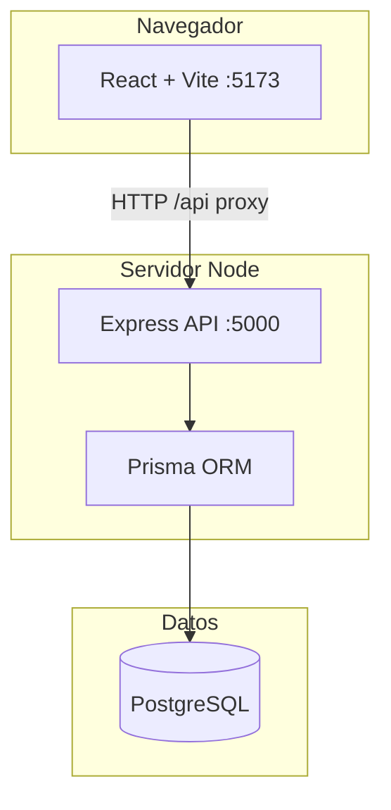

# Arquitectura

## Vista general

El proyecto es un **monorepo** con dos aplicaciones hermanas:

| Carpeta | Rol |
|---------|-----|
| `frontend/` | Interfaz pública + panel admin (misma app React, rutas distintas) |
| `backend/` | API REST + acceso a base de datos |

No hay un paquete npm workspaces unificado: cada carpeta tiene su propio `package.json` y `node_modules`.

## Capas del frontend

| Capa | Ubicación | Responsabilidad |
|------|-----------|-----------------|
| Páginas | `frontend/src/pages/` | Una ruta principal por archivo (`LandingPage`, `CustomizerPage`, …) |
| Componentes | `frontend/src/components/` | UI reutilizable (navbar, tarjetas, admin, mundial) |
| Servicios | `frontend/src/services/api.js` | Llamadas HTTP al backend (Axios) |
| Datos estáticos | `frontend/src/data/` | Constantes, Mundial 2026, rutas de imágenes |
| Estilos | `frontend/src/index.css` | Tema global, componentes editoriales, admin |

**Enrutamiento:** `frontend/src/App.jsx` define las rutas. El área `/admin` oculta navbar/footer del sitio público y usa layout propio.

## Capas del backend

| Capa | Ubicación | Responsabilidad |
|------|-----------|-----------------|
| Entrada | `backend/src/server.js` | Crea Express, CORS, monta `/api` |
| Rutas | `backend/src/routes/index.js` | Mapa URL → controlador |
| Controladores | `backend/src/controllers/` | Lógica de negocio por recurso |
| Middleware | `backend/src/middleware/requireAdmin.js` | Protege rutas con token admin |
| Modelo | `backend/prisma/schema.prisma` | Esquema de tablas |
| Seed | `backend/prisma/seed.js` | Datos iniciales (productos, ejemplos) |

## Autenticación admin (simplificada)

1. El usuario envía contraseña a `POST /api/admin/login`.
2. Si coincide con `ADMIN_PASSWORD`, el API devuelve `ADMIN_TOKEN`.
3. El frontend guarda el token en `localStorage` y lo envía en header `Authorization: Bearer …`.
4. Rutas marcadas con `requireAdmin` rechazan peticiones sin token válido.

No hay roles múltiples ni JWT con expiración: es suficiente para un emprendimiento académico con un solo administrador.

## Despliegue pensado (opcional)

- **Frontend:** Vercel (`frontend/vercel.json`)
- **Backend:** Render (`backend/render.yaml`)
- **BD:** Neon u otro PostgreSQL gestionado

Detalle en [PUBLICAR-EN-INTERNET.md](./PUBLICAR-EN-INTERNET.md).
