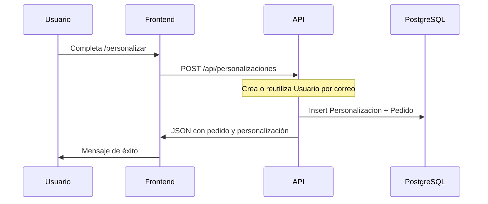

# Flujo de datos

## Pedido desde el sitio público

**Campos principales del pedido:**

- Usuario: `nombre`, `correo`, `carrera`
- Personalización: `color`, `seleccion_favorita`, `modelo`, `texto_personalizado`
- Pedido: `precio` (según modelo), `estado` inicial `pendiente`

El precio se calcula en backend según el `modelo` (`classic` / `pro` / `elite`).

## Panel administrador

1. `POST /api/admin/login` con `{ password }`.
2. Frontend guarda token en `localStorage` (`goaldesk_admin_token`).
3. Peticiones siguientes llevan header `Authorization: Bearer <token>`.
4. `AdminPage` carga en paralelo: `GET /stats`, `GET /pedidos`, `GET /usuarios`.
5. Cambio de estado: `PATCH /api/pedidos/:id/estado` con `{ estado }`.

Estados válidos: `pendiente`, `imprimiendo`, `entregado`.

## Catálogo de productos

`GET /api/productos` es público. Si la BD está vacía, el frontend usa precios de `constants.js` como respaldo.

El seed carga tres productos alineados con los modelos GoalDesk.

## QR y red local

`GET /api/network-info` devuelve IPs locales del servidor para armar URLs accesibles desde el celular.

El hook `useQrBaseUrl` en frontend combina:

- `VITE_APP_URL` si está definida
- `PUBLIC_APP_URL` del backend (túnel)
- IP detectada en red local
- URL actual del navegador (evitando `localhost` en móvil)
